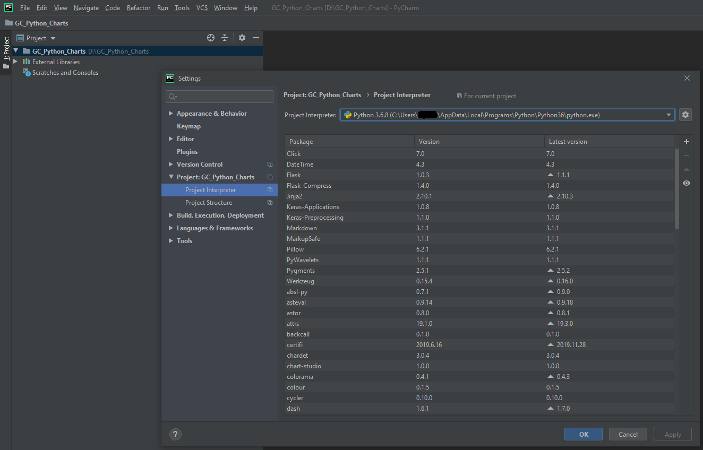

# Golden Cheetah Python Chart wrapper
[Golden Cheetah](https://www.goldencheetah.org) (GC) is an analytic software that lets you get the value out of all your data.
This wrapper program is enabling you to build more advance python charts and debug them.

Within GC you can create python charts for more information on that look [UG_Special Topics_Working with Python](https://github.com/GoldenCheetah/GoldenCheetah/wiki/UG_Special-Topics_Working-with-Python)

This project is created based on GC version 3.5 

Any remarks or questions post on [User Forum](https://groups.google.com/forum/#!forum/golden-cheetah-users)

# Prerequisite
I assume you have GC installed and python up and running in GC.
And your python is at least configured as described in [UG_Special Topics_Working with Python](https://github.com/GoldenCheetah/GoldenCheetah/wiki/UG_Special-Topics_Working-with-Python)
For now this is only tested with pycharm and on windows 10.   

# Choose your favorite python IDE.
For this project I use PyCharm for download see [PyCharm](https://www.jetbrains.com/pycharm/).
Once you have create a project and selected your desired python interpreter for easy interoperability use the same that is configured in GC.



# Setting up the data
There are a few example script when those are executed in GC you should be able to create you first charts with your own IDE.
In the folder `example_extractions_scripts` these script could be copied into a GC python chart
Note: update the location where your data needs to be stored: `f = open('D:/git-repos/GoldenCheetah_Python_Chart_Wrapper/GC_DATA/activity_xxx_data.py', "w+")
`

Note: When you have executed them all `activity`/`trend` and `athlete zones` you should be able to execute provided example charts.
If you haven't executed them you probable get an error like:
 
```python
Traceback (most recent call last):
  File "D:/git-repos/GoldenCheetah_Python_Chart_Wrapper/activity_small_example.py", line 34, in <module>
    main()
  File "D:/git-repos/GoldenCheetah_Python_Chart_Wrapper/activity_small_example.py", line 26, in main
    act = GC.activity()
  File "D:\git-repos\GoldenCheetah_Python_Chart_Wrapper\GC_Wrapper\GC_wrapper.py", line 91, in activity
    from GC_DATA import activity_xxx_data
ImportError: cannot import name 'activity_xxx_data'
```

# Be creative :)
Sometimes you need special data you can implement this in the GC_wrapper functions. A small example is given below to get 
specific season metrics:
```python
def seasonPmc(all=False, metric="TSS"):  # to get PMC data for any given metric
    if metric == "TSS" or metric == "BikeStress":
        return season_pmc_data.all_TSS

    # Rest Not implemented yet
    return None
```

# Add Chart to GC
Simple copy paste the content of the python file and remove the following line:
 
 `from GC_Wrapper import GC_wrapper as GC`

And don't forget to share your charts in the cloud db function of GC so other also benefit from it :) 

